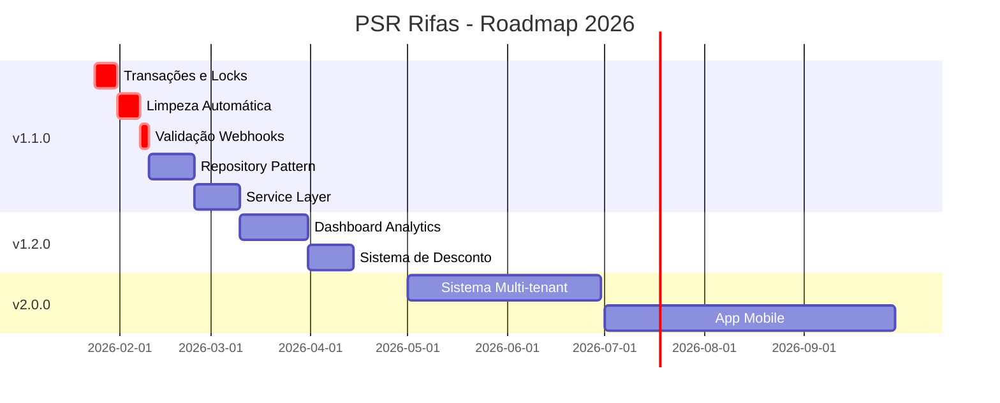

<p align="center"><a href="https://valdeir.dev" target="_blank"></a></p>

<p align="center">
<a href="https://github.com/valdeirpsr/psr-rifas/blob/main/LICENSE"></a>
<a href="https://github.com/valdeirpsr/psr-rifas/actions/workflows/tests.yml"></a>
<a href="https://github.com/valdeirpsr/psr-rifas/actions/workflows/check-codes.yml"></a>
<a href="https://twitter.com/valdeirpsr"></a>
</p>

# PSRifas

Hoje eu quero compartilhar com vocês um projeto de estudo incrível que eu desenvolvi: um sistema de rifa digital, que permite que você crie e gerencie suas próprias rifas online.

Com esse sistema, você pode escolher sua forma de pagamento preferida, criar rifas personalizadas, definir o ganhador e ter uma página exclusiva para vender seus bilhetes.

É muito fácil, rápido e divertido! Você pode usar esse sistema para arrecadar dinheiro para uma causa nobre, para realizar um sonho, para estudar o funcionamento do projeto ou simplesmente para se divertir com seus amigos. O sistema é seguro, confiável e transparente. Você pode acompanhar todas as informações das suas rifas em tempo real e receber o pagamento diretamente na sua conta.


## Demonstração

<table border="0">
<tr>
<td><b>Comprando bilhetes</b></td>
<td><b>Definindo bilhete premiado</b></td>
</tr>
<tr>
<td><a href="https://youtube.com/shorts/DoeD1DB_Jo8" target="_blank"></a></td>
<td><a href="https://youtube.com/shorts/GmjgG-M2XDI" target="_blank"></a></td>
</tr>
</table>


## Variáveis de Ambiente

Para rodar esse projeto, você vai precisar adicionar as seguintes variáveis de ambiente no seu .env

```
# Prazo de pagamento
# Caso o prazo seja atingido e o pagamento não seja feito,
# o pedido será removido e os números liberados
RIFA_EXPIRE_AT_MINUTES=60
```

```
# Access Token do MercadoPago para gerenciar seu pagamento
MERCADOPAGO_ACCESS_TOKEN=<string>
```


## Rodando localmente

Clone o projeto

```bash
  git clone https://github.com/valdeirpsr/psr-rifas.git
```

Entre no diretório do projeto

```bash
  cd psr-rifas
```

Instale as dependências do PHP

```bash
  composer require
```

Crie a estrutura do banco de dados

```bash
  php artisan migrate

  # Com dados fakes (opcional)
  php artisan migrate --seed
```

Instale as dependências do javascript

```bash
  pnpm i
```

Inicie o servidor do PHP

```bash
  php artisan serve
```

Inicie vite

```bash
  pnpm dev
```
## Rodando localmente com Docker Compose

Clone o projeto

```bash
  git clone https://github.com/valdeirpsr/psr-rifas.git
```

Entre no diretório do projeto

```bash
  cd psr-rifas
```

Execute o comando abaixo no seu terminal

```bash
  docker run --rm --volume "$PWD:/app" composer require --ignore-platform-reqs;
  docker compose up -d;
```

Caso seja necessário, acesse o container `laravel.test` e execute o vite

```bash
  docker-compose exec laravel.test sh -c "pnpm dev"
```

## Rodando os testes

Para rodar os testes do *JavaScript*, execute o seguinte comando

```bash
  npx vitest
```

Para rodar os testes do *Laravel*, execute o seguinte comando

```bash
  php artisan test
```
## Deploy

Leia [Deployment com Laravel](https://laravel.com/docs/11.x/deployment)

## Stack utilizada

**Front-end:** Vue 3, Vite, Typescript, InertiaJs, TailwindCSS 3.x

**Back-end:** PHP 8.2, Laravel 11.x

## Roadmap

# 🗺️ Roadmap - PSR Rifas

Este documento descreve o planejamento de desenvolvimento do PSR Rifas, incluindo funcionalidades planejadas, melhorias de arquitetura e otimizações.

---

## 📌 Legenda

- 🔴 **Crítico** - Problemas de segurança ou bugs graves
- 🟠 **Alta Prioridade** - Funcionalidades importantes ou melhorias significativas
- 🟡 **Média Prioridade** - Funcionalidades desejadas
- 🟢 **Baixa Prioridade** - Melhorias e refinamentos
- ✅ **Concluído** - Já implementado
- 🚧 **Em Progresso** - Atualmente em desenvolvimento
- 📋 **Planejado** - Próximas implementações
- 💡 **Ideias** - Propostas para análise futura

---

## 🎯 Versão Atual: 1.0.0

### ✅ Funcionalidades Implementadas

- [x] Sistema básico de criação de rifas
- [x] Compra de bilhetes com seleção manual
- [x] Integração com MercadoPago
- [x] Painel administrativo com Filament
- [x] Interface responsiva com Vue 3 + Tailwind
- [x] Sistema de autenticação
- [x] Testes automatizados (PHPUnit + Vitest)
- [x] CI/CD com GitHub Actions
- [x] Suporte Docker

---

## 🔄 Versão 1.1.0 - Melhorias de Arquitetura (Em Progresso)

### 🔴 Crítico - Segurança e Estabilidade

#### 1. Implementar Transações e Locks Anti-Race Condition
**Status:** 🚧 Em Progresso  
**Prioridade:** 🔴 Crítica

**Problema:**
Múltiplos usuários podem reservar os mesmos bilhetes simultaneamente, causando double-booking.

**Solução:**
```php
// Implementar lockForUpdate() nas transações
DB::transaction(function () {
    $tickets = Ticket::where('rifa_id', $rifaId)
        ->whereIn('number', $numbers)
        ->where('status', 'available')
        ->lockForUpdate()
        ->get();
});
```

**Tarefas:**
- [ ] Adicionar locks pessimistas em compras
- [ ] Implementar retry logic
- [ ] Criar testes de concorrência
- [ ] Adicionar logs de conflitos
- [ ] Documentar comportamento

---

#### 2. Sistema Automatizado de Limpeza de Pedidos Expirados
**Status:** 📋 Planejado  
**Prioridade:** 🔴 Crítica

**Problema:**
Pedidos expirados não são removidos automaticamente, causando acúmulo de dados órfãos.

**Solução:**
```php
// Command: CleanExpiredOrders
php artisan orders:clean-expired

// Schedule: Executar a cada 5 minutos
$schedule->command('orders:clean-expired')->everyFiveMinutes();
```

**Tarefas:**
- [ ] Criar Command CleanExpiredOrders
- [ ] Implementar lógica de liberação de bilhetes
- [ ] Configurar schedule no Kernel
- [ ] Adicionar notificações de expiração
- [ ] Criar testes automatizados
- [ ] Adicionar métricas de limpeza

**Estimativa:** 1 semana

---

#### 3. Validação de Webhooks do MercadoPago
**Status:** 📋 Planejado  
**Prioridade:** 🔴 Crítica

**Problema:**
Webhooks não validam assinatura, permitindo requisições maliciosas.

**Solução:**
```php
// Middleware: VerifyMercadoPagoSignature
Route::post('/webhooks/mercadopago', [WebhookController::class, 'handle'])
    ->middleware('verify.mercadopago.signature');
```

**Tarefas:**
- [ ] Criar middleware de validação
- [ ] Implementar verificação de assinatura
- [ ] Adicionar rate limiting
- [ ] Criar logs de tentativas inválidas
- [ ] Implementar retry automático
- [ ] Documentar configuração

**Estimativa:** 3 dias

---

### 🟠 Alta Prioridade - Arquitetura

#### 4. Implementar Repository Pattern
**Status:** 📋 Planejado  
**Prioridade:** 🟠 Alta

**Objetivo:**
Desacoplar lógica de negócio da camada de dados, facilitando testes e manutenção.

**Estrutura:**
```
app/Repositories/
├── Contracts/
│   ├── RifaRepositoryInterface.php
│   ├── TicketRepositoryInterface.php
│   └── OrderRepositoryInterface.php
├── Eloquent/
│   ├── RifaRepository.php
│   ├── TicketRepository.php
│   └── OrderRepository.php
└── RepositoryServiceProvider.php
```

**Tarefas:**
- [ ] Criar interfaces dos repositórios
- [ ] Implementar repositórios Eloquent
- [ ] Criar ServiceProvider
- [ ] Refatorar controllers para usar repositórios
- [ ] Adicionar cache layer nos repositórios
- [ ] Criar testes unitários
- [ ] Documentar padrões de uso

**Estimativa:** 2 semanas

---

#### 5. Service Layer para Lógica de Negócio
**Status:** 📋 Planejado  
**Prioridade:** 🟠 Alta

**Objetivo:**
Centralizar lógica de negócio complexa em services reutilizáveis.

**Services a criar:**
```
app/Services/
├── PaymentService.php        # Processamento de pagamentos
├── TicketService.php          # Gestão de bilhetes
├── DrawService.php            # Lógica de sorteios
├── NotificationService.php    # Envio de notificações
└── ReportService.php          # Geração de relatórios
```

**Tarefas:**
- [ ] Criar PaymentService com MercadoPago
- [ ] Implementar TicketService
- [ ] Criar DrawService para sorteios
- [ ] Desenvolver NotificationService
- [ ] Implementar ReportService
- [ ] Adicionar testes de integração
- [ ] Documentar APIs dos services

**Estimativa:** 2 semanas

---

#### 6. Form Requests com Validação Robusta
**Status:** 📋 Planejado  
**Prioridade:** 🟠 Alta

**Objetivo:**
Substituir validações inline por Form Requests dedicados.

**Requests a criar:**
```
app/Http/Requests/
├── Rifa/
│   ├── StoreRifaRequest.php
│   ├── UpdateRifaRequest.php
│   └── DrawRifaRequest.php
├── Ticket/
│   ├── PurchaseTicketRequest.php
│   └── ReserveTicketRequest.php
└── Order/
    ├── ProcessPaymentRequest.php
    └── CancelOrderRequest.php
```

**Tarefas:**
- [ ] Criar Form Requests para todas as operações
- [ ] Implementar regras de validação customizadas
- [ ] Adicionar mensagens de erro personalizadas
- [ ] Implementar authorize() methods
- [ ] Criar testes de validação
- [ ] Documentar regras de validação

**Estimativa:** 1 semana

---

### 🟡 Média Prioridade - Funcionalidades

#### 7. Dashboard Analytics Avançado
**Status:** 📋 Planejado  
**Prioridade:** 🟡 Média

**Funcionalidades:**
- Gráfico de vendas por período
- Ranking de compradores
- Métricas de conversão
- Taxa de ocupação de rifas
- Receita total e projeções
- Estatísticas de pagamento

**Componentes:**
```
resources/js/Pages/Dashboard/
├── Analytics.vue
├── Components/
│   ├── SalesChart.vue
│   ├── TopBuyers.vue
│   ├── ConversionMetrics.vue
│   └── RevenueCard.vue
└── types/analytics.ts
```

**Tarefas:**
- [ ] Criar endpoints de analytics
- [ ] Implementar cache de métricas
- [ ] Desenvolver componentes Vue
- [ ] Adicionar gráficos com Chart.js
- [ ] Implementar filtros por data
- [ ] Criar exportação de relatórios
- [ ] Adicionar testes E2E

**Estimativa:** 3 semanas

---

#### 8. Sistema de Desconto por Quantidade
**Status:** 📋 Planejado  
**Prioridade:** 🟡 Média

**Funcionalidades:**
- Desconto progressivo por quantidade
- Cupons de desconto
- Promoções por tempo limitado
- Desconto para compradores recorrentes

**Estrutura:**
```sql
-- Migration: create_discounts_table
id, rifa_id, type, min_quantity, max_quantity, 
discount_type, discount_value, valid_from, valid_until
```

**Tarefas:**
- [ ] Criar migration de descontos
- [ ] Implementar lógica de cálculo
- [ ] Adicionar interface de configuração
- [ ] Criar validações de cupons
- [ ] Implementar logs de uso
- [ ] Adicionar testes de desconto
- [ ] Documentar tipos de desconto

**Estimativa:** 2 semanas

---

#### 9. Agendamento de Publicação de Rifas
**Status:** 📋 Planejado  
**Prioridade:** 🟡 Média

**Funcionalidades:**
- Agendar data/hora de publicação
- Agendar data/hora de encerramento
- Notificações automáticas
- Rascunhos de rifas

**Implementação:**
```php
// Model: Rifa
published_at, scheduled_at, expires_at

// Job: PublishScheduledRifas
php artisan rifas:publish-scheduled
```

**Tarefas:**
- [ ] Adicionar campos de agendamento
- [ ] Criar Job de publicação
- [ ] Implementar notificações
- [ ] Adicionar interface no Filament
- [ ] Criar testes de agendamento
- [ ] Documentar fluxo

**Estimativa:** 1 semana

---

### 🟢 Baixa Prioridade - Otimizações

#### 10. Implementar Cache Estratégico
**Status:** 📋 Planejado  
**Prioridade:** 🟢 Baixa

**Áreas de cache:**
- Lista de rifas ativas (5 minutos)
- Detalhes de rifa (10 minutos)
- Contagem de bilhetes (1 minuto)
- Estatísticas do dashboard (15 minutos)

**Implementação:**
```php
// Cache de rifas ativas
Cache::remember('rifas:active', 300, function () {
    return Rifa::active()->get();
});

// Invalidação ao atualizar
Cache::forget('rifas:active');
Cache::tags(['rifa:' . $id])->flush();
```

**Tarefas:**
- [ ] Implementar cache Redis
- [ ] Adicionar cache tags
- [ ] Criar estratégia de invalidação
- [ ] Implementar cache warming
- [ ] Adicionar métricas de hit/miss
- [ ] Documentar estratégias

**Estimativa:** 1 semana

---

#### 11. Otimização de Queries (N+1)
**Status:** 📋 Planejado  
**Prioridade:** 🟢 Baixa

**Problemas comuns:**
```php
// ❌ N+1 Problem
$rifas = Rifa::all();
foreach ($rifas as $rifa) {
    echo $rifa->user->name; // Query extra
}

// ✅ Eager Loading
$rifas = Rifa::with('user')->get();
```

**Tarefas:**
- [ ] Identificar queries N+1 com Debugbar
- [ ] Implementar eager loading
- [ ] Adicionar withCount() onde necessário
- [ ] Criar índices no banco
- [ ] Otimizar queries complexas
- [ ] Adicionar monitoring de queries lentas

**Estimativa:** 1 semana

---

#### 12. Integração com Meilisearch
**Status:** 💡 Ideia  
**Prioridade:** 🟢 Baixa

**Funcionalidades:**
- Busca full-text em rifas
- Filtros avançados
- Busca por tags
- Autocomplete

**Tarefas:**
- [ ] Configurar Meilisearch
- [ ] Implementar Laravel Scout
- [ ] Criar índices de busca
- [ ] Desenvolver interface de busca
- [ ] Adicionar filtros facetados
- [ ] Implementar sugestões

**Estimativa:** 2 semanas

---

## 🚀 Versão 2.0.0 - Recursos Avançados

### Planejado para Q2 2026

#### 13. Sistema Multi-tenant
**Status:** 💡 Ideia  
**Prioridade:** 🟡 Média

**Funcionalidades:**
- Múltiplos organizadores
- Domínios personalizados
- Temas customizáveis
- Gestão de permissões
- Billing por organizador

**Estimativa:** 2 meses

---

#### 14. Outras Formas de Pagamento
**Status:** 💡 Ideia  
**Prioridade:** 🟡 Média

**Integrações planejadas:**
- Pix direto (QR Code)
- PayPal
- Stripe
- PagSeguro
- Carteira digital

**Estimativa:** 1 mês por gateway

---

#### 15. Sistema de Afiliados
**Status:** 💡 Ideia  
**Prioridade:** 🟢 Baixa

**Funcionalidades:**
- Links de afiliados
- Comissões configuráveis
- Dashboard de afiliados
- Pagamento automático
- Relatórios de conversão

**Estimativa:** 1 mês

---

#### 16. App Mobile (React Native)
**Status:** 💡 Ideia  
**Prioridade:** 🟢 Baixa

**Funcionalidades:**
- Notificações push
- Compra rápida
- QR Code scanner
- Compartilhamento social
- Modo offline

**Estimativa:** 3 meses

---

#### 17. Transmissão ao Vivo de Sorteios
**Status:** 💡 Ideia  
**Prioridade:** 🟢 Baixa

**Funcionalidades:**
- Streaming via WebRTC
- Chat ao vivo
- Sorteio com animação
- Gravação automática
- Compartilhamento social

**Estimativa:** 1 mês

---

## 🛠️ Melhorias Técnicas Contínuas

### Infraestrutura

- [ ] Implementar monitoring com Sentry
- [ ] Configurar APM com New Relic
- [ ] Adicionar health checks
- [ ] Implementar circuit breaker
- [ ] Configurar CDN para assets
- [ ] Implementar backup automático
- [ ] Configurar disaster recovery

### Qualidade de Código

- [ ] Aumentar cobertura de testes para 80%+
- [ ] Implementar análise estática com PHPStan (level 8)
- [ ] Adicionar mutation testing
- [ ] Configurar pre-commit hooks
- [ ] Implementar code review automático
- [ ] Adicionar performance testing

### Documentação

- [ ] Criar documentação de API (OpenAPI)
- [ ] Escrever guias de contribuição detalhados
- [ ] Criar tutoriais em vídeo
- [ ] Documentar arquitetura da aplicação
- [ ] Criar changelog automatizado
- [ ] Adicionar exemplos de uso

### DevOps

- [ ] Implementar blue-green deployment
- [ ] Configurar rollback automático
- [ ] Adicionar smoke tests
- [ ] Implementar feature flags
- [ ] Configurar staging environment
- [ ] Automatizar deploys

---

## 📊 Métricas de Sucesso

### KPIs Técnicos

- **Tempo de resposta:** < 200ms (p95)
- **Disponibilidade:** > 99.9%
- **Cobertura de testes:** > 80%
- **Security score:** A+
- **Performance score:** > 90
- **Zero critical bugs** em produção

### KPIs de Negócio

- **Taxa de conversão:** > 5%
- **Tempo médio de compra:** < 3 minutos
- **NPS:** > 50
- **Churn rate:** < 5%
- **Crescimento mensal:** > 10%

---

## 🤝 Como Contribuir com o Roadmap

1. Abra uma [Discussion](https://github.com/docerol/psr-rifas/discussions) para propor novas funcionalidades
2. Vote em funcionalidades existentes
3. Comente com sugestões e melhorias
4. Submeta Pull Requests para itens do roadmap

---

## 📅 Cronograma Estimado



---

## 📝 Notas

- Este roadmap é um documento vivo e será atualizado regularmente
- As datas são estimativas e podem mudar baseado em prioridades
- Funcionalidades podem ser adicionadas ou removidas conforme necessário
- Contribuições da comunidade podem acelerar o desenvolvimento

---

## 📞 Feedback

Tem sugestões para o roadmap? Abra uma issue ou discussion:

- 💡 [Propor nova funcionalidade](https://github.com/docerol/psr-rifas/issues/new?template=feature_request.md)
- 🐛 [Reportar bug](https://github.com/docerol/psr-rifas/issues/new?template=bug_report.md)
- 💬 [Discussão geral](https://github.com/docerol/psr-rifas/discussions)

---

<div align="center">

**Última atualização:** Janeiro 2026

**[⬆ Voltar ao topo](#️-roadmap---psr-rifas)**

</div>

## Aprendizados

Durante a construção deste projeto, aprendi muito sobre a estrutura e o funcionamento do Laravel, que é um framework PHP poderoso e flexível para o desenvolvimento web.
Entendi melhor alguns padrões que podem ser usados no Laravel e o funcionamento de alguns deles.

Além disso, aprofundei meus conhecimentos sobre testes no Laravel, explorando diversas abordagens para garantir a qualidade do código e a estabilidade do projeto. Tanto testes de integração quanto testes diretamente no models. Ainda não testei o PHPest, mas não fará oportunidade para conhecê-lo e usá-lo.

Um dos maiores desafios que enfrentei foi entender completamente o funcionamento do Eloquent ORM, mas foi resolvido com o fácil suporte em queries complexas.

Outro desafio que encontrei foi a integração direta do Laravel com o Vue.js. No início, cogitei transformar o Laravel em um sistema de API e usar requisições no Vue 3 para exibir os dados para o usuário. No entanto, fui capaz de superar esse obstáculo com o uso do pacote Inertia.js.

Ademais, o Filament me ajudou a criar toda estrutura do painel de controle. Foi uma oportunidade de aprender como integrar soluções externas ao projeto, aproveitando suas funcionalidades para economizar tempo e esforço no desenvolvimento.

No geral, o processo de construção deste projeto foi muito enriquecedor. Conheci algumas limitações e pude aprender a superá-las. Ao final, sinto que ganhei um conhecimento valioso sobre o ecossistema Laravel e sua integração com tecnologias.
